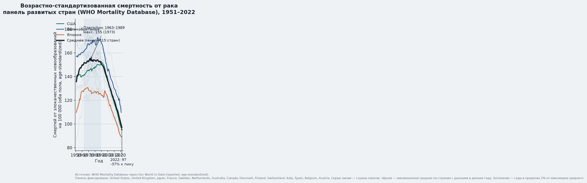
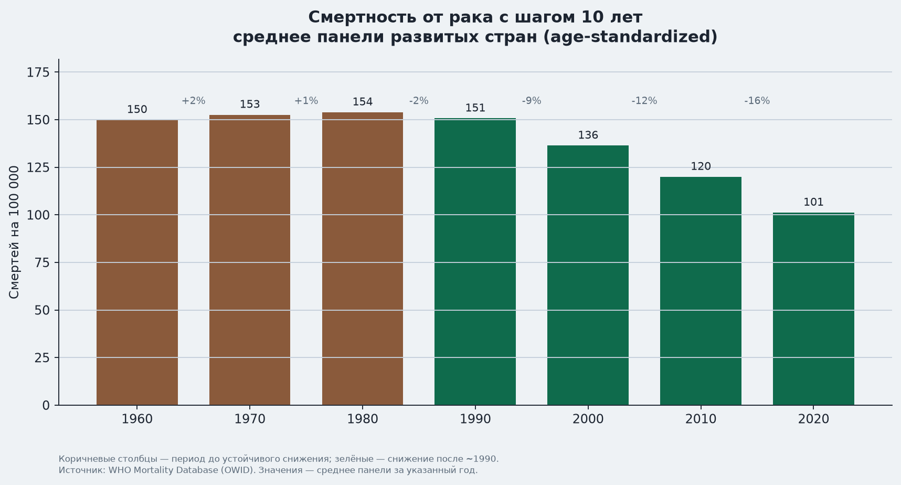

# Смертность от рака: тренд в развитых странах

Возрастно-стандартизованная смертность от злокачественных новообразований
по фиксированной панели из 15 развитых стран с длинной и полной регистрацией смертей.

## Вердикт

- **1950–конец 1980-х:** рост, затем высокое плато.
- **С ~1990:** устойчивое снижение.
- К **2022** среднее панели ≈ **97** смертей на 100 000 (−**37%** от пика среднего, −**36%** относительно 1990).

Метрика: age-standardized rate (оба пола). Абсолютное число смертей из‑за старения населения может расти даже при падении этой ставки.

## Графики





## Данные

| Поле | Значение |
|---|---|
| Источник | [WHO Mortality Database](https://www.who.int/data/data-collection-tools/who-mortality-database) через [Our World in Data](https://ourworldindata.org/grapher/cancer-death-rate-who-mdb) |
| Метрика | Age-standardized deaths from malignant neoplasms per 100,000 |
| Панель | США, Великобритания, Япония, Франция, Швеция, Нидерланды, Австралия, Канада, Дания, Финляндия, Швейцария, Италия, Испания, Бельгия, Австрия |
| Ряд | 1951–2022 |

Почему не «весь мир»: в многих странах покрытие регистрации смертей неполное; глобальные оценки GLOBOCAN/IHME частично смоделированы и хуже для длинного сопоставимого тренда.

## Снимки по десятилетиям

| Год | Среднее панели |
|---:|---:|
| 1960 | 149.9 |
| 1970 | 152.6 |
| 1980 | 153.9 |
| 1990 | 150.7 |
| 2000 | 136.4 |
| 2010 | 120.0 |
| 2020 | 101.2 |
| 2022 | 97.1 |

## Смертность по возрасту (шаг 5 лет, с 40)

Возрастно-специфичные ставки (на 100 000 в данной возрастной группе), среднее той же панели:

см. [`AGE_SPECIFIC_TABLE.md`](AGE_SPECIFIC_TABLE.md) и `age_specific_mortality_table.csv`.

Кратко: с 1990 по 2022 смертность снизилась во всех возрастах от 40 лет; сильнее всего в 40–54 (−~50–54%), слабее в 85+ (−9%).

## Воспроизведение

```bash
pip install pandas matplotlib
python cancer-mortality/build_charts.py
python cancer-mortality/build_age_table.py
```

Скрипты скачают CSV OWID (если нет локальной копии) и пересоберут таблицы/графики.
